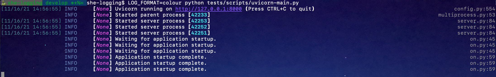
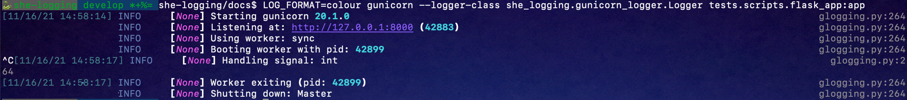
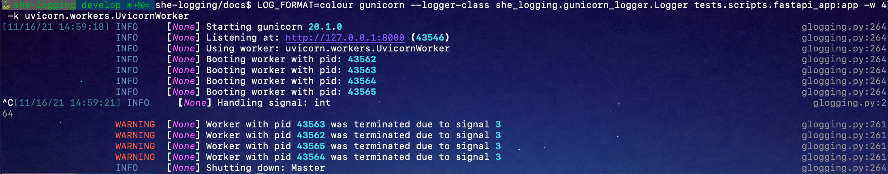

# she-logging
A common logging configuration for Sensyne Health microservices.

## Maintainers
The Polaris platform was created by Sensyne Health Ltd., and has now been made open-source. As a result, some of the
instructions, setup and configuration will no longer be relevant to third party contributors. For example, some of
the libraries used may not be publicly available, or docker images may not be accessible externally. In addition, 
CICD pipelines may no longer function.

For now, Sensyne Health Ltd. and its employees are the maintainers of this repository.

## Overview

Python's logging is initialised to produce JSON format log records (override with LOG_FORMAT environment)
and the log level is set to INFO (override using LOG_LEVEL environment)

| Environment variable | Description |
|----------------------|-------------|
|LOG_LEVEL | Sets log level for the root logger. Default `INFO`, other values `DEBUG`, `WARNING`, `ERROR`|
| LOG_FORMAT | Default `json`, other values `plain`, `colour` or `color` |
| LOG_LEVEL_CONNEXION | Default `INFO` |
| LOG_LEVEL_NEOBOLT | Default `INFO` |
| LOG_LEVEL_NEO4J | Default `WARNING` |
| LOG_LEVEL_OPENAPI_SPEC_VALIDATOR | Default `INFO` |
| LOG_LEVEL_PIKA | Default `INFO` |
| LOG_LEVEL_GUNICORN | Default `INFO` |
| LOG_LEVEL_UVICORN | Default `INFO`|
| LOG_LEVEL_UVICORN_ACCESS | Default `INFO` |
| LOG_LEVEL_UVICORN_ERROR | Default `INFO` |
| LOG_LOCALS | Default `True`, when `LOG_FORMAT=colour` includes local variables in stack traces. Set to `False` to disable. |
| COLUMNS | when `LOG_FORMAT=colour` it sets the width of logging output. Default is the width fo the console window. Use this with colour logging in a docker container where the width cannot be detected automatically. |

## Colour logging

To enable colour logging install she-logging with `extras=colour` to add `rich` as a dependency, or just ensure you install `rich`.

Logs will be colour when the output device is detected as a terminal (otherwise monochrome).
Tracebacks in this mode are enhanced to include context and optionally local variables.

The coloured logs show times to one second accuracy and for clarity omit duplicated times. 

## Use
For simple cases just import and use the logger. Logging is initialised when the first log message is output:
```python
from time import sleep

from she_logging import logger

def foo(x:int, y:int) -> float:
    return x/y

logger.info('Hello world')
logger.debug("Debug message", extra={"data": {"hello": 1, "world": 42}})
sleep(1)
try:
    foo(1, 0)
except ZeroDivisionError as e:
    logger.exception('It blew up')

```


### Uvicorn Logging

Uvicorn is best started using a python script, pass it SHE_LOGGING_CONFIG for its logging configuration.
She-logging does not need to be initialised separately.

```python
import uvicorn

from she_logging import SHE_LOGGING_CONFIG

if __name__ == "__main__":
    uvicorn.run("tests.scripts.fastapi_app:app", host="127.0.0.1", port=8000, log_config=SHE_LOGGING_CONFIG, workers=3)
```

```shell
$ python tests/scripts/uvicorn-main.py
```


### Gunicorn Logging

Gunicorn accepts a logger class as a command line option. This is the preferred way to use it with she-logging as simply
initialising she_logging within the app will result in gunicorn's own messages being formatted incorrectly.

Either of these commands will have the desired effect:
```shell
gunicorn --logger-class egg:she_logging#gunicorn tests.scripts.flask_app:app
gunicorn --logger-class she_logging.gunicorn_logger.Logger tests.scripts.flask_app:app
```



#### Gunicorn + Uvicorn
The recommended configuration for production is to run uvicorn under gunicorn. This can be done simply by including
the logger-class for gunicorn and uvicorn will use the correct logger.
N.B. To use gunicorn and uvicorn together in this way you must also install uvtools and httptools.
```shell
$ gunicorn --logger-class she_logging.gunicorn_logger.Logger tests.scripts.fastapi_app:app -w 4 -k uvicorn.workers.UvicornWorker
```


### `init_logging()`
When used within a framework it may be useful to initialise logging explicitly by calling `init_logging()`. This
function may also be used to override the log configuration:

```python
from she_logging.logging import init_logging, SHE_LOGGING_CONFIG

init_logging() # Uses default configuration
# or
init_logging(config=SHE_LOGGING_CONFIG)
# or
init_logging(config="log_config.yaml")
```

Any calls to `init_logging()` after logging has been initialised by another package will use the SHE logging 
configuration for new loggers. Existing loggers will continue to work but may not use the correct handler.

`init_logging()` takes an optional configuration as a dict, a JSON or Yaml filename, or the yaml of the configuration.

Sample logging configuration:

```yaml
formatters:
  json:
    (): "she_logging.logging.CustomisedJSONFormatter"
  simple:
    format: '[%(asctime)s] %(levelname)s [%(requestID)s] in %(module)s:%(lineno)s: %(message)s'
handlers:
  json:
    class: logging.StreamHandler
    formatter: json
    stream: ext://sys.stdout
  plaintext:
    class: logging.StreamHandler
    formatter: simple
    stream: ext://sys.stdout
loggers:
  uvicorn:
    level: INFO
  uvicorn.access:
    level: INFO
    propagate: false
  uvicorn.error:
    level: INFO
root:
  handlers:
  - json
  level: DEBUG
version: 1
```


## Installation

Clone the repo, enter the newly created directory

Build and activate a virtualenv using the `make install` command:
```
make install
```

## Running the Unit Tests

Tests can be run using `pytest` or `tox` - it's up to you. The `make` command uses `tox` but `py.test` runs faster.

```
make test
```
The default `make test` or `tox` targets test using both Python 3.9 and Python 3.6. You should ensure both are 
available if you use these tests. To make alternative Pythons available in a pyenv environment you can add them to the
`pyenv local` configuration (but you must already have installed the correct version(s)):

```shell
$ make pyenv
$ pyenv local she-logging 3.6.12
```
The tests should also pass using Python 3.9 but that is not verified by the automated testing.

You can also run them using the standard commands:

```
# run all
pytest
```

## Running the Circle CI Unit Test Workflow

This is the unit & integration tests, coverage reports and linters (black, safety, isort etc.) and ran by Tox

```
make circleci-test
```

## Running Coverage

Coverage should be 100%. To run the coverage report alone:

```
make test-coverage
```

## Releasees

See https://sensynehealth.atlassian.net/wiki/spaces/SENS/pages/87588957/Library+releases

Please maintain up to date GitHub releases with every `she_logging` release.

Thank you.
